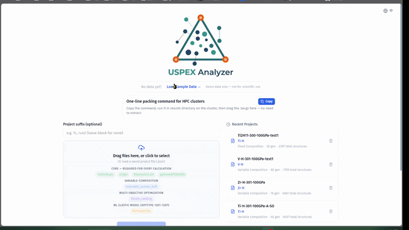
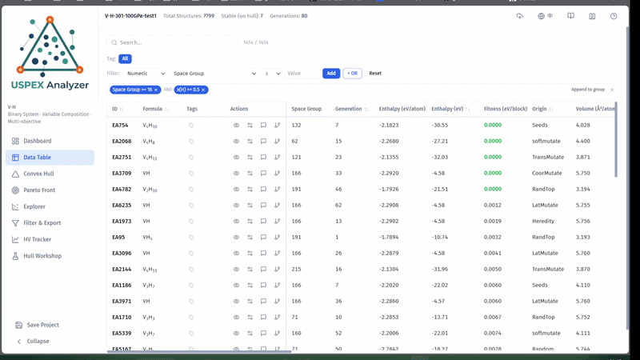
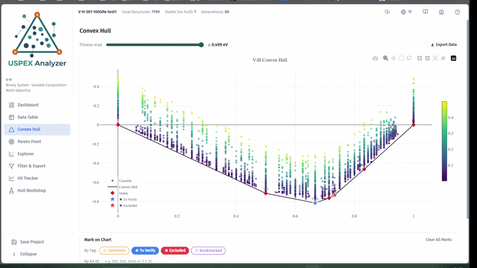
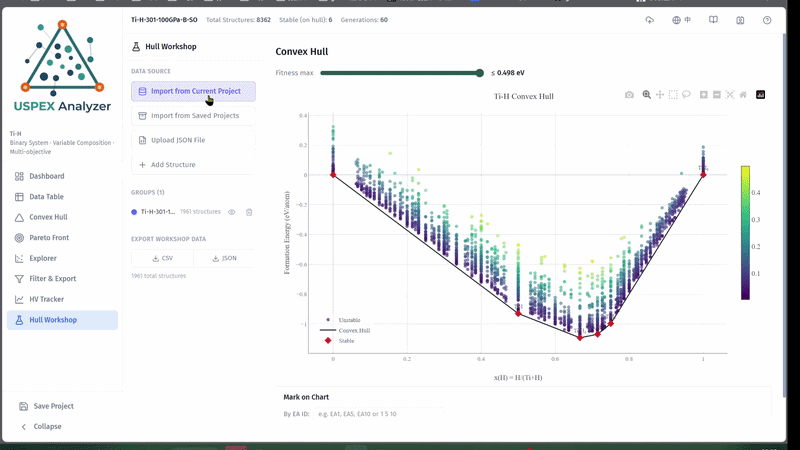
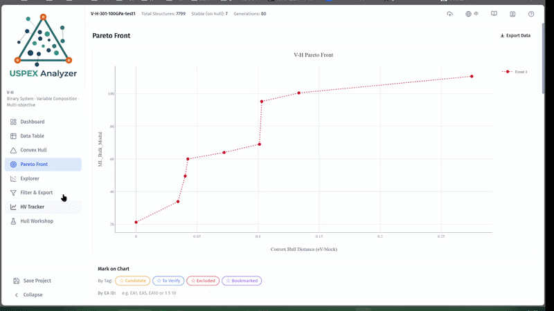
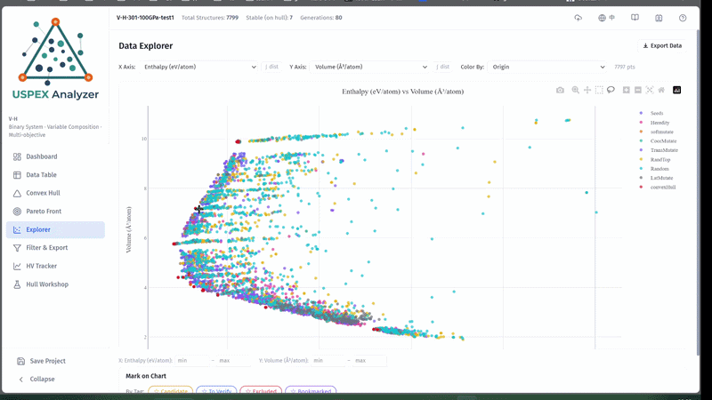
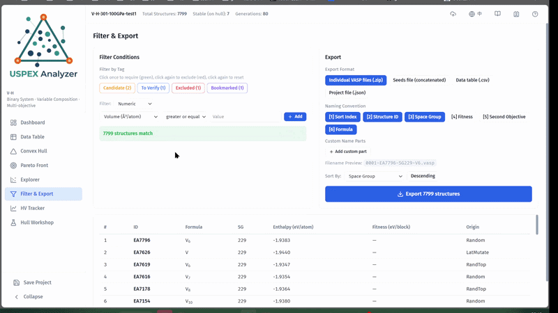
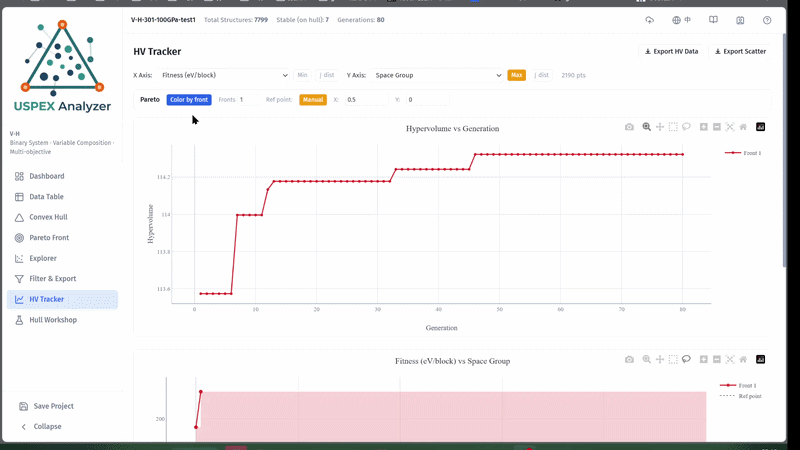

# USPEX Analyzer —— v1.4.1

A browser-based analysis tool for USPEX crystal structure prediction outputs. Supports 3D bulk, 2D structure search, and variable/fixed-composition calculations. **Now compatible with both USPEX 10.5/10.6 and USPEX 25** — the tool auto-detects your data format and adapts file requirements accordingly. Upload your USPEX output files and interactively explore, visualize, filter, and export your results — all without installing anything.

**Live Demo**: [https://chen121760.github.io/USPEX-Analyzer/](https://chen121760.github.io/USPEX-Analyzer/)

> This tool is listed on the official [USPEX Tools & Utilities](https://uspex-team.org/zh/uspex/tools) page.

## Features

- Data Table — Sortable, searchable table with all structure properties merged from multiple files
- Convex Hull — Interactive 2D/3D convex hull visualization with hover details
- **Hull Workshop** — Merge multi-group data into a unified convex hull; add fixed-composition calculations to refine the hull or compute hull energies for all structures against a combined reference. Supports importing from current project, saved projects (multi-select), and JSON files. **Manually add a structure** (composition + enthalpy) to instantly test whether it expands (lowers) the convex hull — if it does, the chart shows the new hull as a solid line and the previous hull as a dashed line; all internal structures' fitness values are recalculated against the expanded hull. Ideal for exploring "what-if" candidate phases or incorporating known compounds from literature
- Pareto Front — Multi-objective Pareto front visualization (auto-detected)
- Explorer — Universal scatter plot with color mapping, dual-range slider filter, autoplay, and GIF export
- HV Tracker — On-the-fly Pareto front computation on any two axes with hypervolume-vs-generation convergence tracking
- Genealogy — View the parent and offspring relationships of any structure
- Tags — Label structures as Candidate / To Verify / Excluded / custom tags
- Filter & Export — Query builder with AND/OR conditions, export as .zip / seeds / .csv
- **Export Data** — Every chart has a one-click Export Data button that downloads the currently visible data as an Origin-compatible CSV, respecting all active filters
- Project Save/Load — Save all data + annotations as .json, reload anytime
- Times New Roman typography for all Latin text and numbers across the UI and charts
- **Page Guide** — Right-side guide drawer with feature overview and background knowledge for key pages; guide state is project-wide and remembered across pages

## Demo

**Upload & Load**

**Data Table**

**Convex Hull**

**Hull Workshop**

**Pareto Front**

**Explorer**

**Filter**

**HV Tracker**

## Supported USPEX Files

The tool auto-detects whether your data comes from USPEX 10.5 (legacy format) or USPEX 25 and adapts file requirements accordingly.

### USPEX 10.5 — Core files (all 4 required)

| File | Description |
|------|-------------|
| `Individuals` | All predicted structures, including generation, composition, enthalpy/fitness, and fingerprint information |
| `origin` | Parent-child genealogy and variation history of structures |
| `Parameters.txt` | Element information and run metadata |
| `gatheredPOSCARS` | Relaxed crystal structures in POSCAR format |

### USPEX 25 — Core files (minimum 2)

| File | Description |
|------|-------------|
| `Individuals` | All predicted structures with USPEX25 column schema (`generation number num_atoms_all energy ...`) |
| `gatheredPOSCARS` | Relaxed crystal structures in POSCAR format (`number=ID` markers) |

### Optional files (workflow-specific, both versions)

| File | Description | When to upload |
|------|-------------|----------------|
| `extended_convex_hull` | Convex hull data for variable-composition calculations | Upload for variable-composition searches |
| `Pareto_ranking` | Ranking results for multi-objective optimization | Upload for multi-objective runs |
| `MLProperties` | ML-predicted properties from elastic-modulus machine-learning models | Upload for `optType 1201–1207` |

### Notes

- If the run is a variable-composition calculation, also upload `extended_convex_hull`.
- If the run is a multi-objective optimization, also upload `Pareto_ranking`.
- If the run uses the elastic-modulus machine-learning model (`optType 1201–1207`), you may also upload `MLProperties`.

