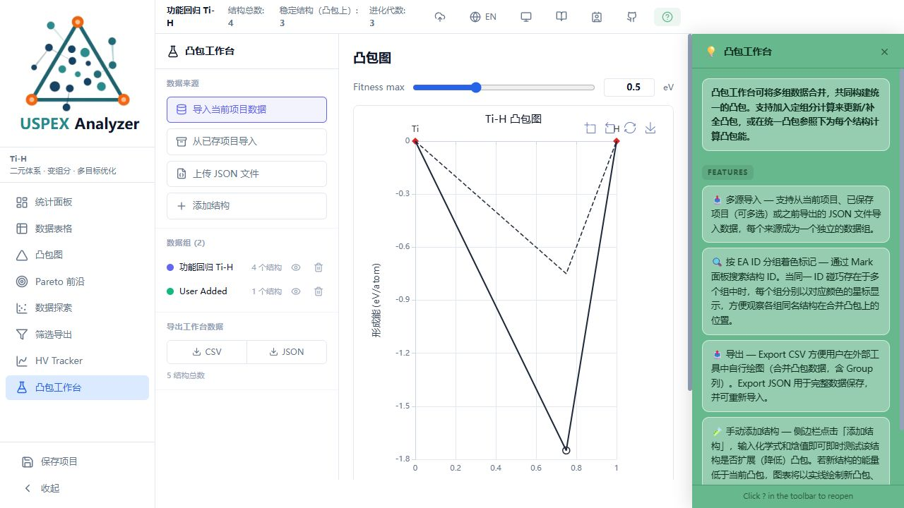

# 功能修复与回归验证

日期：2026-10-02。对应 [功能审查](2026-10-02-feature-audit.md) 中的 13 项问题。

## 修复结果

| 审查项 | 处理结果 |
| --- | --- |
| 1. 手动结构能量单位 | 输入保留为 eV/atom，总能量乘以原子数。TiH₃ 输入 −3 得到总能量 −12、形成能 −1.75。 |
| 2. 多项目元素顺序 | 导入和 JSON 导出按统一元素顺序重排原子数；坐标由重排后的组分重新计算。组分块的行顺序可以不同，块定义和单位必须一致。 |
| 3. 固定组分排名 | 按相同化学计量的每原子焓计算相对能量，不依赖纯元素参考；不同晶胞大小得到一致的排名。 |
| 4. −1 形成能 | 各凸包视图、表格、探索字段与数值筛选使用统一的可用性判断。有效 −1 保留，缺失形成能不再替换为原始焓。 |
| 5. HV 的 900 上限 | 移除对任意轴值、颜色值的 900 截断；检查结构收敛状态及坐标有限性。代数或体积 1000 的有效结构参与计算。 |
| 6. 无效项目 JSON | 校验结构数组、组分及相关元数据后再替换项目。失败保留原数据，finally 清除加载状态；会话恢复也捕获异常。 |
| 7. 筛选 JSON | 导出所选结构和对应统计数据，保留所选手动结构。结果使用独立项目 ID，重新载入不会覆盖完整项目。 |
| 8. 普通散点 CSV | 普通模式导出全部当前筛选数据；前沿模式按前沿数量限制导出。 |
| 9. 默认播放和 GIF | 两个探索页面共用帧序列；上限已到最大时从下限重新播放，包含首尾帧；无效步长不会产生无限循环。 |
| 10. Explorer GIF 聚焦 | 页面和 GIF 复用散点、标记及边际分布的绘图函数，遵循隐藏、淡化、高亮状态及二维/三维选择。 |
| 11. Pareto 标记 | 标记和计数遵循已选前沿；取消全部前沿的状态在切页后保留。HV 的标记及边际分布也使用相同的可见数据集。 |
| 12. 异步自动保存 | 移除分散的保存调用。会话和命名项目使用同一事务、同一快照，按顺序写入；异常捕获并显示提示，进度更新不触发保存。 |
| 13. 工作台 JSON 兼容性 | 当前项目、已存项目和 JSON 导入共用兼容性检查，核对元素、压力和组分块。整个批次先验证，避免部分导入。 |

另外，工作台 JSON 保存手动结构标志和对称性数据；JSON 中的 null 能量保持缺失状态。README 的凸包介绍改为功能和使用方式，删除实现细节及修复过程的解释。

## 验证

- `npm test`：16 组、433 项检查通过，包括新增的 40 项功能回归检查。原有解析、组分块、二元/三元/四元凸包、固定组分、对称性、绘图适配器、三角形缩放、筛选和项目状态检查全部通过。
- 新检查调用真实领域函数、store 和页面回调；下载、定时器与 GIF 输出替换为可检查的边界，验证实际绘图数据和导出行数。
- `npm run build`：TypeScript 检查与生产构建通过。
- `npm run lint`：0 个错误；保留原有 25 个警告。
- 真实 Be–Ti–H 项目：3739 个结构、11 个稳定相；二维三角形放大及三维视图切换正常。
- 隔离的生产构建测试：当前项目导入、手动添加 TiH₃、形成能 −1.75、新旧凸包显示、表格、备注、谱系、POSCAR 查看、moyo 对称性分析及结构对比均正常。刷新后项目、备注和对比选择恢复；HV 普通模式显示全部 4 个结构，播放从默认满范围重新开始，停止及重置正常。

